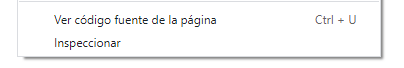
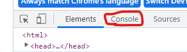

# Preparativos para programar en JavaScript

Para programar en JavaScript se necesita algún editor de texto, estos, como su nombre lo indica, son para escribir texto, no confundir con los procesadores de texto (como Word, GDoc, OpenOffice). Los editores de texto escriben texto plano sin formato, los programadores lo usaban para crear código rápido cuando no querían abrir un IDE o instalar uno para cosas pequeñas, son ligeros y con bajos consumo de recursos

Con el paso del tiempo se fueron creando herramientas y funciones a estos editores, para facilitar el desarrollo dee código, hasta que se convirtieron en herramientas tan potentes como un IDE.

Entre los más populares tenemos a:

- Visual Studio Code
- Notepad++
- Sublime Text
- Vim (editor de consola)
- Emacs (editor de consola
- Atom (actualmente no mantenido)
- Entre muchos otros

También están los IDE (Integrated Development Environment, entorno de desarrollo integrado), herramientas mucho más pesadas y potentes. No se suelen usar para editar archivos, sino proyectos completos. Al tener más herramientas y funciones, piden una mayor cantidad espacio en disco y requieren una mayor cantidad de recursos de procesador y memoria.

Entre los más conocidos tenemos:

- Eclipse
- IntelliJ IDEA
- Android Studio 
- Visual Studio

Para esta guía utilizaremos el editor de texto **Visual Studio Code**, tiene una gran comunidad, es mantenido por una empresa oficial, posee gran variedad de extensiones y es fácil de configurar. Pero eres libre de utilizar cualquier otro tipo de editor de código o IDE.

[Link a la página de VS Code](https://code.visualstudio.com/)


## Un poquito de historia de JavaScript

JavaScript es el lenguaje que se usa en los navegadores, es lo que hace las páginas web interactivas. Se creó en 1995 como una forma de agregar programas a las páginas web que al principio eran estáticas, simplemente HTML, no ofrecían contenido dinámico, como las páginas de un libro.

Con el tiempo fue ganando popularidad hasta ser adoptado por casi todos (porque siempre hay excepciones) los navegadores. Pero el lenguaje era tan versátil que se crearon herramientas fuera del navegador que lo utilizan, como en servidores, bases de datos, aplicaciones de escritorio y móviles, hasta videojuegos.

## Preparando JavaScript

Muchos lenguajes de programación requieren de compiladores y otras herramientas para ejecutar el código, JavaScript, solo necesita un navegador.

### Usando el navegador

1. En una carpeta crearemos dos archivos `index.html` y `script.js`
2. Abrir el editor de código y modificar los archivos.
3. Dentro del archivo `index.html` escribiremos la siguiente linea de código:


```html
<script src="./script.js"></script>
```

4. Dentro del archivo `script.js` escribiremos la siguiente línea:

```js
console.log("Hola mundo");
```

5. Luego abriremos el archivo `index.html` en el navegador, generalmente al abrir se nos abrirá en el navegador automáticamente, de no ser así, solo arrastren el archivo al navegador. Debería de salir una página en blanco.
6. Damos clic derecho y luego `inspeccionar`



7. Se nos abrirá un panel, y luego le damos a consola/console:



Y en ese lugar debería salir 

```
Hola mundo
```

:::tip :tada: Felicidades :tada:
Muchas felicidades acaba de de hacer su primer `hola mundo`, pero esto es a penas el comienzo en un vasto recorrido.
:::

### Usando Node.js

Como se dijo anteriormente, se ha llevado fuera del navegador, uno de los entornos más usados actualmente para JavaScript, con una gran comunidad y documentación, es Nodejs. Fue creado para poder llevar a javascript al servidor y no solo en los navegadores.

[Link para descargar Nodejs](https://nodejs.org/)

:::info
Si usa Linux, el proceso es distinto y más largo. 
:::

Cuando se esté instalando, si usa Windows, asegúrese de marcar la casilla de "añadir al path"(add to path), esto es para asegurar que pueda ejecutar Nodejs desde cualquier carpeta. Una vez instalado, cierra y vuelva a abrir su terminales y editores de código.

Abrimos un terminal/consola en la misma carpeta en la que tenemos nuestro archivo `script.js` Veremos una ventana negra con letras blancas, ahí escribiremos lo siguiente.

```bat
node script.js
```

En caso de que de error o que diga que no se reconoce el comando `node`, es que algo debió salir mal durante la instalación. Si todo está correcto debería salir

```
Hola mundo
```

En caso de que no abra la terminal en la misma carpeta, solo debe escribir la ruta antes del nombre del archivo:

```bat
node "/ruta/del/archivo/script.js"
```