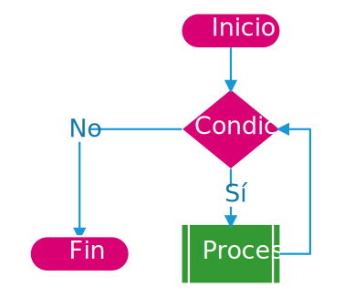

# Bucles

Un bucle es una secuencia de código que se repiten mientras una condición sea verdadera. Una forma de verlo gráficamente sería con un diagrama de flujo.

<div style="display: flex; justify-content: center;">



</div>

Mientras la condición continúe dando como resultado `Sí` es decir verdadero, siempre se ejecutará el proceso. Cuando la condición deje de cumplirse entonces finalizará el proceso. Esto se conoce como `iteración`, que es repetir un proceso hasta alcanzar un objetivo o condición.

Existen varios tipos de bucles, estos son: bucle `for`, `while`, `do while`.

## Bucle `while`

El bucle `while` (mientras), como su nombre indica, mientras se cumpla la condición ejecutará la sección de código.

```js
while (condición) {
    // código que se ejecutará
}
```

Ejemplo: Un programa que verifique si la contraseña es correcta, que se mantenga preguntado mientras no se ingrese la contraseña correcta.

```js
var correct = false;

while (correct == false) {
    var pass = getPass();

    if (pass == SECRET_KEY){
        console.log("Contraseña correcta");
        correct = true;
    } else {
        console.log("Contraseña incorrecta");
    }
}
```

## Bucle `for`

Este bucle se basa en el incremento/decremento de una variable y ejecutará una sección de código hasta que este alcance la condición. Este bucle tiene 3 parámetros, el primero es la declaración de la variable que va a contar, el segundo es la condición, y el tercero es el incremento.

```js
for (variable; condición; incremento){
    // Código a ejecutar
}
```

Ejemplo: Un programa que ejecute una cuenta desde 1 hasta 5.

```js
for(var i=1; i <= 5; i++){
    console.log(i)
}
```

Para entender este código lo analizaremos por partes:

- `var i = 1` se inicia la variable, se inicia en uno porque el problema plantea que de la cuenta inicie en 1.
- `i <= 5` se establece la condición, es decir, hasta cuanto se va a ejecutar, mientras `i` sea menor o igual a `5`, se va a ejecutar la sección.
- `i++` este es el incremento, aquí estamos incrementado a `i` en 1, dado que el problema plantea un incremento simple, es decir, de uno en uno. Este incremento se ejecuta automáticamente al final de la sección dee código.
- `console.log(i)` aquí imprimimos el valor de `i` por la consola, para ver el conteo.

Podemos tomar ejemplo anterior y en vez de un conteo incremental, hacer una cuenta regresiva de `10` a `0`.

```js
for(var i=10; i >= 0; i--){
    console.log(i)
}
```

## Bucle `do ... while`

La sentencia `do while` es muy similar a la sentencia `while`, con la diferencia que el `do while` primero ejecuta la función y luego verifica la condición.

```js
do {
    // Código a ejecutar
} while (condición);
```

La sentencia `do while` ejecuta el código al menos una vez sin importar si la condición iniciar es falsa.

```js
do {
    console.log("Me he ejecutado")
} while (false);
```

## sentencia `break`

La sentencia `break` también se usa cuando se quiere interrumpir un bucle, si se usa dentro de un bucle el programa saldrá del bucle inmediatamente, independientemente de si la condición es falsa, tampoco va a terminar la sección de código.

```js
while(true) {
    // Me ejecuto solo una vez
    break
    // Nunca me ejecutaré
}
```

## Sentencia `next`

La sentencia `next`, interrumpe la ejecución de la sección de código para iniciar la siguiente iteración de del bucle.

Ejemplo un código diga los números pares del 1 al 100, pero si es múltiplo de 5 no haga nada.

```js
for (var i = 0; i<100;i++){
    if (i % 5 == 0 ) next;

    if (i % 2 == 0){
        console.log(i + "- par")
    } else {
        console.log(i + "- impar")
    }
}
```

## ¿Cuál bucle utilizar?

En esencia, los bucles son iguales, la única cosa que cambia es la forma en que manejan las condiciones.

Generalmente los programadores evitan el uso del `while` debido a que, si no se tiene cuidado, puede llevar a loops infinitos, se suele usar el bucle `for` dado a que se puede establecer su número de iteraciones, además es mucho más fácil iterar los **Arreglos/Array** con el bucle for.

La mayoría de los programadores saben lo que están escribiendo, por tanto suelen ya conocer el número de iteraciones que necesitan si van a hacer uso de un bucle.

En otras palabras, usar `while` cuando no sabes el número de interacciones que tendría el bucle. Mientras que `for` es cuando vas a iterar un número conocida de veces.