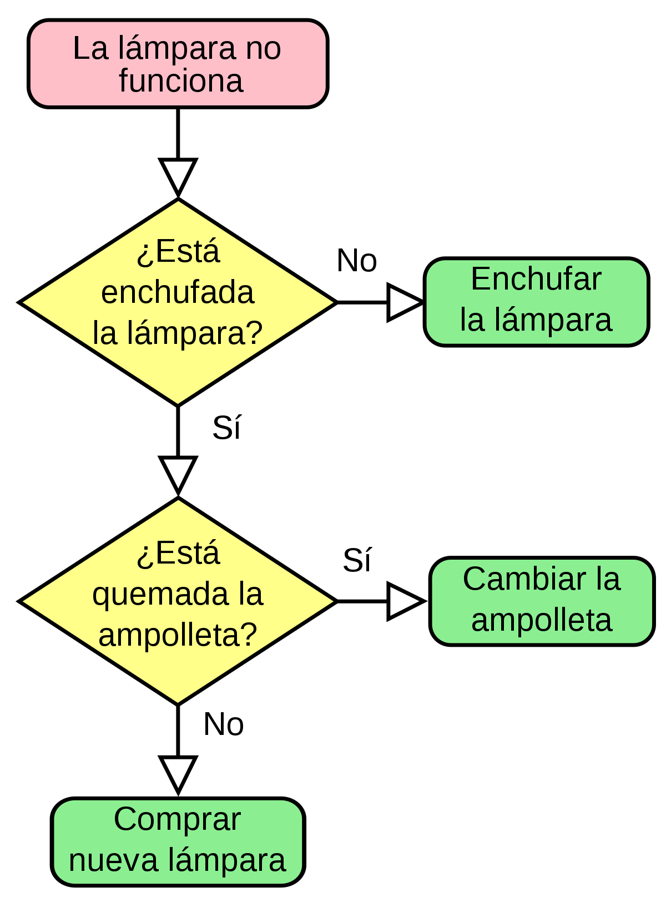

# Diagramas de flujo

Los diagramas de flujo son una manera gráfica de representar una secuencia de procedimientos, algoritmos o pasos.

    

Esto es un ejemplo para revisar si una lámpara está funcionando, pero quizás no se entienda que hace cada uno de esos bloques, así que vamos a explicarlos.

|Símbolo|Nombre|Descripción|
|:------:|:--------:|--------|
||Inicio   Fin|Indica cuando un programa inicia o termina.|
||Condición|Se utiliza para indicar cuando debe tomarse y se bifurca el programa, es decir, que toma un camino u otro|
||Proceso|Se utiliza para indicar que se debe realizar alguna acción|
||Salid o escritura de información|Un nodo que se utiliza cuando el proceso debe guardar la información o mostrar algún dato (aunque el bloque de process bien podría usarse para estos casos)|
||Sub proceso|Se utiliza para ejecutar un proceso que no forma parte del diagrama principal.|
||Conector|Se utiliza para conectar el flujo de un programa a otras partes de flujo, por ejemplo, si no queda más espacio para mostrar en la hoja en vez de trazar una linea de nuevo inicio de la hoja, se coloca un conector que significa un salto|