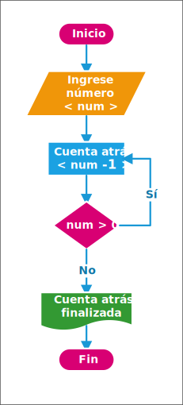

# Ejercicios resueltos de diagramas de flujo

::: warning Aviso
Sección aun en desarrollo, solo el ejercicio 1 posee solución, aun así, siéntase en la libertad de tratar de realizar los ejercicios por su cuenta.
:::

## Ejercicio 1

Realizar un diagrama de flujo de servir un café.

::: details Solución
Nota: Puede de otra forma, dado que es una actividad cotidiana, no requiere de procedimientos exactos. Por ejemplo, agregar azúcar, elegir tazas, etc.

:::

## Ejercicio 2

Realizar un diagrama de flujo que pida la entrada de un número, y que determine si es mayor o igual que `5`.

::: details Solución

:::

## Ejercicio 3

Un diagrama de flujo que se le ingrese dos números y muestre su suma.

::: details Solución

:::

## Ejercicio 4

Realizar un diagrama de flujo que se ingrese un número si es mayor que `0`, que diga que el número es positivo, si es menor a `0` debe decir que es negativo y si es igual a `0`, debe decir que es `0`.

::: details Solución

:::

## Ejercicio 5

Un diagrama de flujo que se ingrese un número y que muestre una cuenta regresiva hasta el `0`

::: details Solución

:::

## Ejercicio 6

Un diagrama de flujo que se ingrese un número y se deben sumar los números desde el `1` hasta el número dado.

::: details Solución

:::

## Otros Ejercicios

Si los ejercicios anteriores te parecieron un poco complicados, practica realizando diagramas de flujo de actividades cotidianas, como los mostrados en la sección [I-C: Entendiendo la Lógica](03-entendiendoLogica.md#ejercicios), son más fáciles dado que estos tienen más libertad de creación.