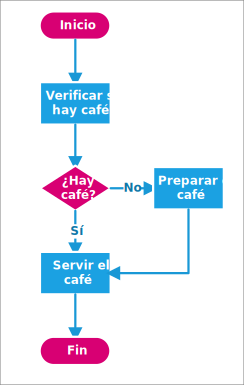

# Ejercicios resueltos de diagramas de flujo

::: warning Aviso
Sección aun en desarrollo, solo el ejercicio 1 posee solución, aun así, siéntase en la libertad de tratar de realizar los ejercicios por su cuenta.
:::

## Ejercicio 1

Realizar un diagrama de flujo de servir un café.

::: details Solución
Nota: Puede de otra forma, dado que es una actividad cotidiana, no requiere de procedimientos exactos. Por ejemplo, agregar azúcar, elegir tazas, etc.

:::

## Ejercicio 2

Realizar un diagrama de flujo que pida la entrada de un número, y que determine si es mayor o igual que `5`.

::: details Solución
Para resolver este ejercicio enumeramos los que no pide el enunciado

1. Introducir un número
2. Determinar **SI** es mayor o igual que 5.

El primer paso es una entrada de datos, nos pide introducir un valor, el segundo paso es una condicional, lo que significa que el flujo se va a dividir en dos caminos, uno si el número es mayor o igual que `5` y el otro si resulta ser menor, y con esto finalizaríamos.

:::

## Ejercicio 3

Un diagrama de flujo que se le ingrese dos números y muestre su suma.

::: details Solución
Planteamos los pasos

1. Ingresar un número
2. Ingresar otro número
3. Sumar los números
4. Mostrar el resultado

El primer paso es ingresar un número, pero como nos piden dos, ingresamos otro, recordando que las computadoras solo pueden ejecutar una acción, por lo que debemos ingresar un numero después del otro. Luego nos pide mostrar la suma de ambos número, como bien dijimos, solo puede hacer una acción a la vez, primero sumamos los número y después mostramos el resultado.

:::

## Ejercicio 4

Realizar un diagrama de flujo que se ingrese un número si es mayor que `0`, que diga que el número es positivo, si es menor a `0` debe decir que es negativo y si es igual a `0`, debe decir que es `0`.

::: details Solución
Planteamos los pasos

1. Ingresar un número
2. Si el número es mayor que `0`, decir que es positivo
3. Si el número es menor que `0`, decir que es positivo
4. Si es igual a `0`, decir que es `0`

Lo primero que se nos pide es ingresar un número, luego verificar si ese número es positivo (mayor que `0`), luego verificar si negativo (menor que `0`), y por último, si es igual a `0`, fíjate que tenemos 3 condiciones en el planteamiento del problema, pero el diagrama solo dibujé dos, esto es porque esta comparación sería redundante, dado que si no es mayor o menor que `0` la última opción es que sea el `0`.

:::

## Ejercicio 5

Un diagrama de flujo que se ingrese un número y que muestre una cuenta regresiva hasta el `0`

::: details Solución

:::

## Ejercicio 6

Un diagrama de flujo que se ingrese un número y se deben sumar los números desde el `1` hasta el número dado.

::: details Solución

:::

## Otros Ejercicios

Si los ejercicios anteriores te parecieron un poco complicados, practica realizando diagramas de flujo de actividades cotidianas, como los mostrados en la sección [I-C: Entendiendo la Lógica](03-entendiendoLogica.md#ejercicios), son más fáciles dado que estos tienen más libertad de creación.